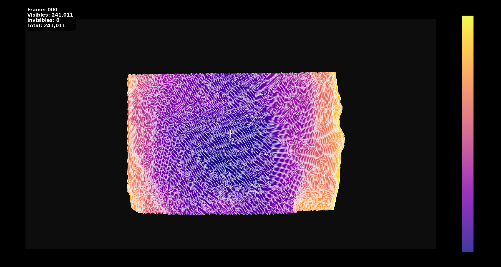

# Brain Force Estimation Pipeline

## Table of Contents

- [Overview](#overview)
- [Installation](#installation)
- [Architecture](#architecture)
- [File Structure](#file-structure)
- [Core Libraries](#core-libraries)
- [Complete Pipeline](#complete-pipeline)
- [Configuration](#configuration)
- [Data Formats](#data-formats)
- [Advanced Features](#advanced-features)

---

## Overview

Complete biomechanical brain simulation pipeline with force estimation capabilities using the SOFA Framework. This system generates realistic surgical simulation data with synchronized 3D geometry, forces, and camera projections for machine learning applications.

### Key Capabilities

- **Advanced SOFA Simulation** with realistic automatic surgical deformers
- **Force Estimation** with noise modeling
- **Synchronized Data Capture** (geometry, forces, images, camera parameters)
- **3D→2D Projection** with real camera matrices
- **Vertex Overlay on Images** to visualize the projected surfaces' vertices on original images

---

## Installation

### Prerequisites

```bash
# SOFA Framework (tested with v25.06)
# Available at: https://www.sofa-framework.org/

# Python dependencies
pip install numpy torch torchvision tqdm Pillow opencv-python
```

---

## Architecture

```
SOFA Simulation → Force Recording → 3D Projection →       Training
     ↓                   ↓                  ↓                ↓
  brain.py         AnimationRecorder  npz_projection.py   [Documented on another github]
     +                   +                  +
 simlib.deformers   simlib.recorders   Camera Matrices
```

### Data Processing Stages

1. **Simulation** - SOFA biomechanical simulation with advanced deformers
2. **Recording** - Multi-modal capture (positions, forces, images, camera)
3. **Export Stage** - NPZ format with displacement vectors to simulation_output/
4. **Projection** - 3D→2D conversion with real camera parameters
5. **Visualization Stage** - Vertex overlays on images

---

## File Structure

```
ForceEstimation/
├── Core Simulation
│   ├── brain.py                           # Main SOFA simulation
│   ├── simlib/                           # Custom simulation library
│   │   ├── recorders.py                  # AnimationRecorder with force capture
│   │   ├── deformers.py                  # Surgical tools (QuadSlide, DeepPress)
│   │   ├── forces.py                     # Force aggregation and conversion
│   │   ├── camera.py                     # Camera parameter extraction
│   │   └── visual.py                     # Visual monitoring tools
│   └── data/                             # Brain meshes and textures
│       ├── surface_full.obj              # Full brain surface mesh
│       ├── surface_full_decimated.obj    # Optimized surface mesh
│       ├── surface_skull.obj             # Skull surface mesh
│       ├── volume_simplified.obj         # Volumetric mesh for FEM
│       ├── texture.png                   # Original brain texture
│       ├── texture_outpaint.png          # New brain texture used for the simulation
│       ├── texture_outpaint2.png         # Original brain texture outpainted (variant 2, used for detection)
│       ├── craniotomy_region_texture_common.npz      # Auto-detected surgical region
│       └── craniotomy_region_texture_common_meta.json # Detection metadata
├── Data Processing
│   ├── npz_projection.py                 # 3D→2D projection with camera matrices
│   ├── build_2d_datasets.py              # Convert projected NPZ to 2D displacement datasets
│   ├── projected_npz_to_csv.py           # NPZ→CSV conversion (optional)
│   ├── modify_frames_with_noise.py       # Geometric noise augmentation for data enhancement
│   └── overlay_vertices_on_images.py     # Visualization tools
├── Tools
│   ├── tools/detect_craniotomy_from_textures.py  # Automatic craniotomy detection
│   ├── tools/validate_craniotomy_mask.py         # Surgical region validation
│   ├── tools/npz_to_force_heatmaps.py           # Force visualization
│   └── tools/decimate_mesh.py                   # Mesh optimization from 200k vertices to 40k
└── Output Directories
    ├── simulation_output/                 # Simulation results
    │   ├── run_seed_*/                   # Individual simulation runs
    │   │   ├── brain_surface_*_auto.npz  # Surface data with forces
    │   │   ├── brain_surface_*_meta.json # Metadata and quality metrics
    │   │   ├── camera_params_*.json      # SOFA camera parameters
    │   │   └── images/                   # Simulation frames (1920x1080)
    ├── projected_npz/                    # 3D→2D projection results
    ├── datasets_2d/                      # 2D displacement datasets for ML training
    │   └── run_seed_*/                   # Per-run 2D datasets
    ├── datasets_2d_modified/             # Noise-augmented datasets
    │   └── run_seed_*/                   # Augmented versions with geometric noise
    └── overlayed_frames/                 # Visualization outputs
```

---

## Core Libraries

### `simlib.recorders.AnimationRecorder`

Advanced recording system with force capture:

```python
recorder = AnimationRecorder(
    surface_ogl_model=surface_model,
    volume_mo=brain.dofs,                 # Volume mechanical object
    force_sampling_k=8,                   # Force interpolation neighbors
    force_noise_std=0.1,                  # Gaussian noise (N)
    force_noise_rel=0.02,                 # Relative noise (2% of |F|)
    force_noise_outlier_prob=0.01,        # Outlier probability per vertex
    auto_export_frames=2000,               # Incremental export
    capture_images=True,                   # Synchronized image capture
    image_resolution=[1920, 1080]          # HD resolution
)
```

**Features:**

- **Absolute displacements** relative to rest state: `displacement = current_position - rest_position`
- **Force mapping** from volume to surface mesh via interpolation
- **Realistic noise modeling** with multiple noise sources
- **Quality metrics** for force validation

### `simlib.deformers` - Intelligent Surgical Tools

**Smart Region Targeting**: All deformers operate intelligently only within the craniotomy region automatically detected by comparing `texture.png` vs `texture_outpaint2.png` using advanced computer vision techniques.

#### QuadSlideDeformer

```python
deformer = QuadSlideDeformer(
    slide_displacement=5.0,               # Tangential slide (mm)
    slide_direction=[1, 0, 0],           # Slide vector
    push_probability=0.3,                 # Probability of perpendicular push
    restriction_mask_npz="data/craniotomy_region_texture_common.npz"  # Auto-detected region
)
```

#### DeepPressPusher

```python
pusher = DeepPressPusher(
    max_depth=8.0,                       # Maximum penetration depth
    pressure_pattern="gaussian",          # Force distribution
    activation_frames=range(50, 150),     # Time window
    region_mask="data/craniotomy_region_texture_common.npz"  # Surgical boundary
)
```

**Craniotomy Detection Process:**

1. **Texture Analysis** - Compares original brain texture with surgical modification
2. **Differential Processing** - Uses Lab color space or RGB mean differences
3. **Region Segmentation** - Gaussian smoothing + percentile thresholding
4. **UV Mapping** - Projects 2D mask to 3D brain surface vertices
5. **Validation** - Distance analysis and Z-distribution validation

### `simlib.forces.ExternalForceAggregator`

Manages multiple force sources:

```python
aggregator = ExternalForceAggregator(
    deformers=[slide_deformer, press_pusher],
    mechanical_object=brain.dofs,
    force_scale=1000.0                    # Conversion to Newtons
)
```

---

## Complete Pipeline

### Stage 0: Craniotomy Detection (Pre-processing)

```bash
# Automatic detection of surgical region from texture differences
python tools/detect_craniotomy_from_textures.py \
  --brain-surface data/surface_full_decimated.obj \
  --texture-ref data/texture.png \
  --texture-alt data/texture_outpaint2.png \
  --outdir data \
  --mode common \
  --gauss-sigma 2.0
```

**What happens:**

- **Texture Comparison** - Analyzes differences between original and modified brain textures
- **Computer Vision Processing** - Uses Lab color space for perceptually accurate differences
- **Gaussian Smoothing** - Reduces noise with configurable sigma
- **Intelligent Thresholding** - Percentile-based or Otsu automatic threshold selection
- **UV→3D Mapping** - Projects 2D surgical mask to 3D brain surface vertices
- **Quality Validation** - Distance metrics and Z-distribution analysis

**Output:**

```
data/
├── craniotomy_region_texture_common.npz    # Vertex indices in surgical region
├── craniotomy_region_texture_common_meta.json  # Detection metadata
└── craniotomy_validation_stats.json        # Quality metrics
```

### Stage 1: SOFA Simulation

```bash
# Run simulation with specific seed for reproducibility
python brain.py --seed 9999
```

**Configuration options:**

- `--seed` - Random seed for reproducible results - Seed here affects the deformers position and direction for more variability through datasets
- `--frames` - Number of simulation frames (default: 300)
- `--output-dir` - Custom output directory

**What happens:**

- Loads brain mesh (40k surface vertices, volumetric FEM)
- Applies realistic surgical deformations (slide + push)
- Records synchronized data every frame:
  - Surface positions and displacements (absolute vs rest)
  - Volume and surface forces (in Newtons)
  - Camera parameters from SOFA InteractiveCamera
  - HD images (1920x1080) with clean rendering

**Output:**

```
simulation_output/run_seed_9999/
├── brain_surface_*_auto.npz           # Main data (7 keys)
├── brain_surface_*_meta.json          # Quality metrics and metadata
├── brain_surface_*_summary.csv        # Per-frame statistics
├── camera_params_COMPLETE_*.json      # Camera matrices
└── images/frame_*.png                 # Synchronized images
```

### Stage 2: 3D→2D Projection

```bash
# Project 3D coordinates to pixel space using real camera matrices
python npz_projection.py
```

**Features:**

- **Real camera matrices** from SOFA InteractiveCamera
- **Incremental saving** every 50 frames (resume capability)
- **Visibility culling** and depth computation
- **Memory efficient** processing

**Output:** `projected_npz/brain_surface_*_projected.npz`

### Stage 3: 2D Dataset Creation

```bash
# Convert projected NPZ files to 2D displacement datasets
python build_2d_datasets.py --root . --out datasets_2d --verbose
```

**Features:**

- **Batch processing** of multiple simulation runs (run*seed*\*)
- **2D displacement extraction** from projected 3D coordinates
- **Force magnitude computation** from 3D force vectors
- **Cross-platform compatibility** with progress tracking

**Output:** `datasets_2d/run_seed_*/brain_surface_*_2d.npz`

### Stage 4: Noise Augmentation

```bash
# Apply geometric noise to existing frames for data augmentation
python modify_frames_with_noise.py \
  --input_dir datasets_2d \
  --output_dir datasets_2d_modified \
  --noise_percentage 0.05 \
  --displacement_noise 0.10 \
  --modify_ratio 0.3
```

**Features:**

- **Geometric noise augmentation** proportional to displacement range
- **Impact region exclusion** to preserve surgical tool contact areas
- **Selective frame modification** (configurable percentage)
- **Displacement-aware scaling** (±10% of local displacement range)

**Output:** `datasets_2d_modified/run_seed_*/brain_surface_*_2d.npz`

### Stage 5: Visualization & Validation

```bash
# Create vertex overlays for visual validation
python overlay_vertices_on_images.py
```

**Output:** `overlayed_frames/overlay_frame_*.png`

---

## Configuration

### Simulation Parameters

```python
# brain.py configuration
SIMULATION_CONFIG = {
    'duration': 15.0,                     # Simulation time (seconds)
    'dt': 0.05,                          # Time step
    'frames': 300,                       # Total frames to capture
    'seed': 9999,                        # Reproducibility seed
}

DEFORMATION_CONFIG = {
    'slide_displacement': 5.0,            # Tangential slide (mm)
    'push_probability': 0.3,              # Push activation probability
    'max_depth': 8.0,                    # Maximum penetration
    'force_scale': 1000.0,               # N to simulation units
}

NOISE_CONFIG = {
    'force_noise_std': 0.1,              # Absolute noise (N)
    'force_noise_rel': 0.02,             # Relative noise (2% of |F|)
    'force_noise_bias': None,            # Optional constant bias
    'force_noise_outlier_prob': 0.01,    # Outlier probability
    'force_noise_outlier_scale': 10.0,   # Outlier magnitude multiplier
}

# Data augmentation configuration
AUGMENTATION_CONFIG = {
    'noise_percentage': 0.05,            # 5% of points receive noise per frame
    'displacement_noise': 0.10,          # ±10% of displacement range
    'modify_ratio': 0.3,                 # 30% of frames modified
    'exclude_impact_regions': True,      # Exclude high-force areas
}
```

### Camera Parameters

```json
{
  "position": [-86.338, -17.669, 126.0],
  "orientation": [0.049, -0.297, 0.051, 0.952],
  "field_of_view": 45.0,
  "viewport_width": 1920,
  "viewport_height": 1080,
  "znear": 0.1,
  "zfar": 1000.0
}
```

---

## Data Formats

### NPZ Structure (simulation_output/)

```python
{
    'rest': (40652, 3),                 # Rest state positions [mm]
    'frames': (300, 40652, 3),          # Deformed positions per frame [mm]
    'displacements': (300, 40652, 3),   # Absolute displacements [mm]
    'times': (300,),                     # Timestamps [s]
    'surface_forces': (300, 40652, 3),  # Surface forces [N]
    'surface_external_forces': (300, 40652, 3), # External forces [N] -- optional also for other purpose uses
}
```

### Projected NPZ Structure

```python
{
    # Original data
    'rest': (40652, 3),
    'frames': (300, 40652, 3),
    'displacements': (300, 40652, 3),
    'times': (300,),
    'surface_forces': (300, 40652, 3),

    # Projection data
    'projected_pixels': (300, 40652, 2),  # Pixel coordinates [px,py]
    'visibility_masks': (300, 40652),     # Boolean visibility
    'depth_values': (300, 40652)          # Normalized depth [0,1]
}
```

### 2D Dataset NPZ Structure

```python
{
    'disp2d': (2000, 40652, 2),          # 2D displacement vectors [dx,dy]
    'force_mag': (2000, 40652),          # Force magnitude [N]
    'projected_pixels': (2000, 40652, 2), # Pixel coordinates [px,py]
    'visibility': (2000, 40652)          # Boolean visibility mask
}
```

### Noise-Augmented Dataset Structure

Same as 2D Dataset but with:

- **30% of frames modified** with geometric noise
- **5% of visible points** receive noise per modified frame
- **±10% displacement range** noise scaling
- **Impact region exclusion** (high force magnitude areas)

````

### Metadata JSON

```json
{
  "session_id": "a1b2c3d4",
  "frame_count": 300,
  "duration": 15.0,
  "surface_vertex_count": 40652,
  "force_quality": {
    "overall_max": 2.45,                 # Maximum force magnitude [N]
    "overall_mean_of_means": 0.15,       # Average force per frame [N]
    "zero_frames": 0,                    # Frames with no forces
    "mapping_ok": true,                  # Force interpolation quality
    "numeric_ok": true                   # No NaN/Inf values
  },
  "force_noise": {
    "std_abs_N": 0.1,                   # Noise configuration
    "std_rel": 0.02,
    "outlier_prob": 0.01
  },
  "units": {
    "length": "mm",
    "time": "s",
    "force": "N"
  }
}
````

---

## Advanced Features

### Force Noise Modeling

Realistic force noise with multiple components:

```python
# Combined noise model
noise = gaussian_noise + relative_noise + outliers + bias
where:
  gaussian_noise ~ N(0, force_noise_std²)
  relative_noise ~ N(0, (force_noise_rel × |F|)²)
  outliers: random vertices with 10× noise magnitude
  bias: optional constant offset
```

### Geometric Noise Augmentation

Data augmentation with displacement-aware noise:

```python
# Geometric noise model for 2D displacements
noise_scale = displacement_noise * displacement_range_per_point
noise_x ~ N(0, noise_scale_x²)
noise_y ~ N(0, noise_scale_y²)

# Impact region exclusion
exclude_if: force_magnitude > percentile(forces, 90)
```

### Resume Capabilities

All processing stages support resuming:

- **Incremental NPZ saving** every N frames
- **Checkpoint detection** for interrupted runs
- **Partial result validation** before resume

### Quality Validation

Automated quality checks:

- **Force magnitude ranges** (realistic vs. outliers)
- **Temporal consistency** (no sudden spikes)
- **Numerical stability** (no NaN/Inf values)
- **Projection accuracy** (vertex-image alignment)
- **Noise validation** (displacement comparison with thresholding)

---

## Projection Results

Below are examples of vertex projections onto images:

#### Frame 000



#### Frame 050


---

**Created:** October 2025 | **Version:** 3.0 | **Brain Force Estimation Pipeline with Noise Augmentation**
