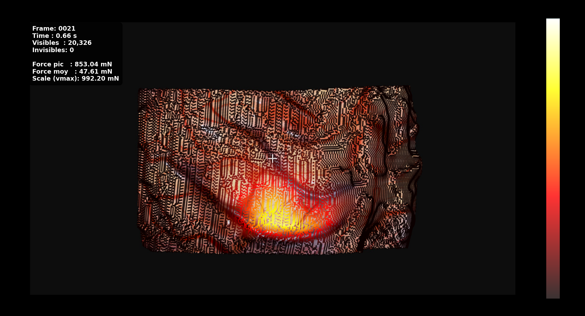

# SOFA-NeuroSim-Recorder

**SOFA-NeuroSim-Recorder** generates supervised training data for vision-based force estimation in neurosurgical simulation. Using the [SOFA](https://www.sofa-framework.org/) physics engine, it simulates tool–tissue interaction on a finite-element brain model, records surface deformations under a fixed microscope camera, and exports aligned **displacement** and **force** labels at each visible surface point.

The goal is to enable learning **force from motion**: in training scenarios, measuring contact force directly is impractical, but the simulator provides ground-truth force maps alongside the rendered tissue motion. Post-processing scripts project the 3D data into image space and build compact 2D datasets (`disp2d`, `force_mag`) for model training.

This repository covers **simulation, recording, and dataset export** only. Force-estimation models are trained separately in **[D2FNet](https://github.com/D3MIA/D2FNet)**. Pre-generated datasets are not included — run the pipeline locally to produce your own data.

<p align="center">
  
  <br/>
  <em>Example — force magnitude projected onto a simulation frame (<code>overlay_vertices_on_images.py</code>).</em>
</p>

<p align="center">
  <video src="https://github.com/user-attachments/assets/YOUR-UUID" controls width="720"></video>
  <br/>
  <em>Example — SOFA brain surface deformation during simulated tool–tissue interaction.</em>
</p>

---

## Overview

| Step | Script | Output |
|------|--------|--------|
| 1. Simulate & record | `brain.py` (SOFA) | `simulation_output/run_E*_nu*_seed*/` |
| 2. Project to image space | `npz_projection.py` | `projected_npz/` |
| 3. Build 2D datasets | `build_2d_datasets.py` | `datasets_2d/` |
| 4. Augment *(optional)* | `modify_frames_with_noise.py` | `datasets_2d_modified/` |
| 5. Visualize *(optional)* | `overlay_vertices_on_images.py` | `overlayed_frames/` |
| 6. Train | [D2FNet](https://github.com/D3MIA/D2FNet) | force-estimation model |

Each run produces paired **displacement fields** and **surface force maps** suitable for learning displacement → force magnitude at each visible vertex.

---

## Quick Start

**Requirements:** [SOFA](https://www.sofa-framework.org/) v25.06.00 (tested), Python 3.10+

```bash
pip install numpy Pillow tqdm matplotlib opencv-python
# optional: scipy scikit-image
```

**1. Run a simulation**

```powershell
# Windows
runSofa .\brain.py
```

```bash
# Linux / macOS
runSofa brain.py
```

SOFA runs headlessly in batch mode, exports data, and closes when the frame budget is reached. Output is written to:

```text
simulation_output/run_E{E}_nu{nu}_seed{seed}/
```

**2. Post-process**

```bash
python npz_projection.py
python build_2d_datasets.py --root projected_npz --out datasets_2d --verbose
```

**3. Train**

Feed `datasets_2d/` (or `datasets_2d_modified/`) into **[D2FNet](https://github.com/D3MIA/D2FNet)**.

---

## Configuration

Parameters are set in **`brain.py`** or overridden via **environment variables**. There are no CLI flags on the SOFA scene.

### Material properties (environment variables)

| Variable | Default | Description |
|----------|---------|-------------|
| `BRAIN_YOUNG` | `0.5` | Young's modulus in **kPa** (0.5 kPa = 500 Pa) |
| `BRAIN_POISSON` | `0.40` | Poisson's ratio |
| `BRAIN_SEED` | `1111` | Random seed (gesture paths & output folder name) |

```powershell
$env:BRAIN_YOUNG = "0.5"; $env:BRAIN_POISSON = "0.40"; $env:BRAIN_SEED = "1111"
runSofa .\brain.py
```

For batch sweeps over multiple material combinations, edit the arrays in **`run_sweep.ps1`** and run it.

### Key settings in `brain.py`

| What | Where in `brain.py` |
|------|---------------------|
| Young's modulus & Poisson ratio | Top of `createScene()` — defaults above, overridable via env vars |
| Tissue mass & damping | `UniformMass`, `DiagonalVelocityDampingForceField` |
| Simulation length | `AnimationRecorder(..., auto_export_frames=...)` |
| Image capture rate | `AnimationRecorder(..., image_every=...)` |
| **Applied tool forces & gestures** | **`QuadSlideDeformer(...)`** — slide/push force ranges, displacement, timing |
| Force label noise | `force_noise_*` variables passed to `AnimationRecorder` |
| Camera | `InteractiveCamera` block |

> **Recording:** force labels use `intensity` mode — the peak surface vertex is scaled to match the total applied tool force.

### Default scene summary

| Setting | Value |
|---------|-------|
| Time step | 0.03 s |
| Tissue mass | 1.0 kg |
| Velocity damping | 2.0 |
| Export frames | 1000 |
| Camera | 1920×1080, FOV 45° |
| Craniotomy radius | 12 mm |
| Force interpolation | k = 8 nearest neighbours (volume → surface) |

---

## Pipeline Details

### Stage 1 — SOFA simulation (`brain.py`)

The scene sets up a sparse-grid FEM brain, a textured surface mesh, a fixed microscope camera, a sliding surgical tool (`QuadSlideDeformer`), and an `AnimationRecorder` that exports:

- 3D rest/deformed positions and displacements
- Per-vertex surface force labels
- Synchronized JPEG frames
- Camera intrinsics/extrinsics (JSON)

### Stage 2 — Projection (`npz_projection.py`)

Projects 3D surface vertices into pixel coordinates using the saved camera parameters. Adds `projected_pixels`, `visibility_masks`, and `depth_values`. Interactive menu — choose option **1** to batch-process all runs in `simulation_output/`.

### Stage 3 — 2D datasets (`build_2d_datasets.py`)

```bash
python build_2d_datasets.py --root projected_npz --out datasets_2d --verbose
```

Produces compact NPZ files with `disp2d`, `force_mag`, and projection metadata — ready for D2FNet.

### Stage 4 — Augmentation *(optional)*

```bash
python modify_frames_with_noise.py \
  --input_dir datasets_2d \
  --output_dir datasets_2d_modified
```

Adds geometric noise to a subset of frames for robustness.

### Stage 5 — Visualization *(optional)*

```bash
python overlay_vertices_on_images.py simulation_output/run_E0.50_nu0.400_seed1111
```

Renders force-coloured overlays on simulation frames. Results are saved under `overlayed_frames/`.

---

## Repository Structure

```text
SOFA-NeuroSim-Recorder/
├── brain.py                  # SOFA scene (simulation + recording)
├── run_sweep.ps1             # Batch material-parameter sweep
├── npz_projection.py         # 3D → 2D projection
├── build_2d_datasets.py      # ML-ready dataset builder
├── modify_frames_with_noise.py
├── overlay_vertices_on_images.py
├── simlib/                   # SOFA controllers (recorder, deformers, camera)
├── tools/                    # Mesh & craniotomy utilities
├── data/                     # Brain meshes, textures, craniotomy mask
└── docs/images/              # Documentation assets
```

Generated outputs (`simulation_output/`, `projected_npz/`, `datasets_2d/`, etc.) are created at runtime and are not part of the repository.

---

## Output Format

| File | Key arrays |
|------|------------|
| Raw NPZ | `rest`, `frames`, `displacements`, `times`, `surface_external_forces` |
| Projected NPZ | above + `projected_pixels`, `visibility_masks`, `depth_values` |
| 2D dataset | `disp2d`, `force_mag`, projection metadata |

Run metadata (material parameters, noise config, vertex counts) is stored alongside each export in `*_meta.json`.

---

## Related Projects

| Repository | Description |
|------------|-------------|
| **[D2FNet](https://github.com/D3MIA/D2FNet)** | Deep network for predicting force magnitude from 2D surface displacements |

